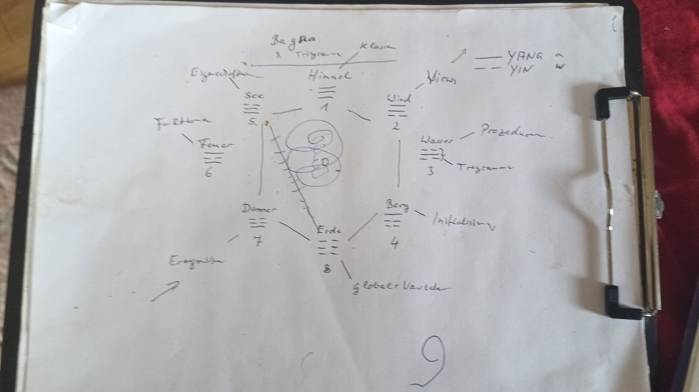
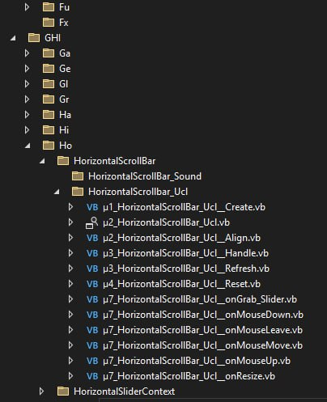
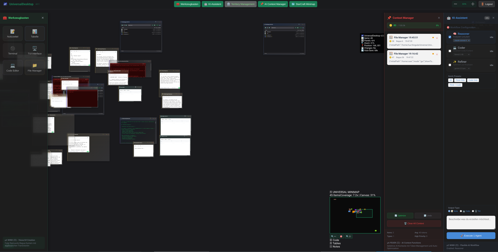
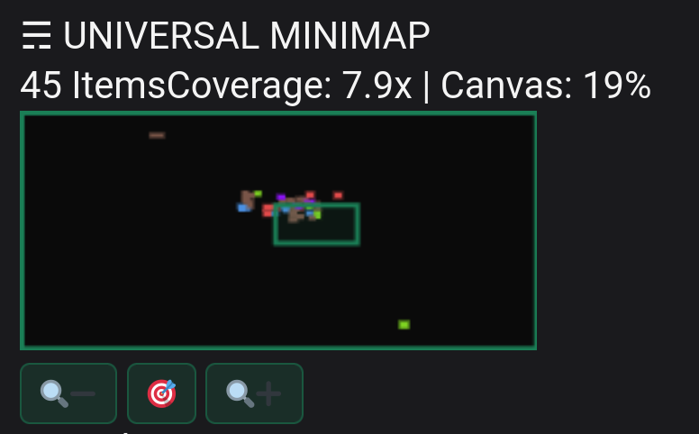
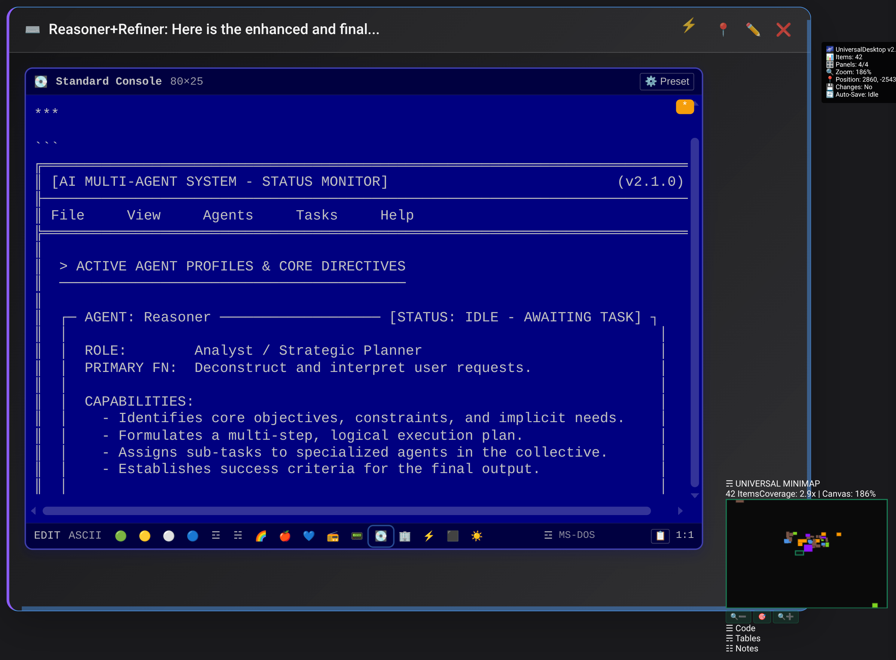
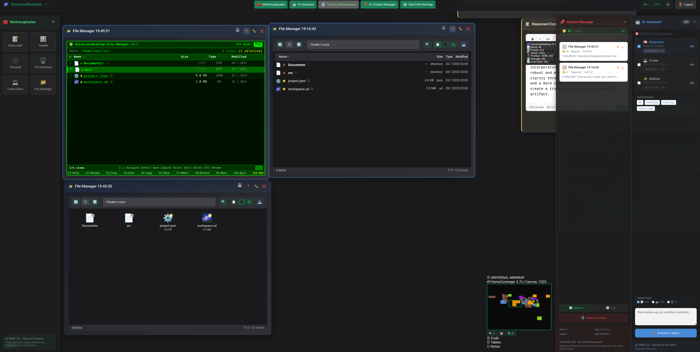

# 🌌 UniversalDesktop v2.1
## Das lebendige Desktop-Betriebssystem mit μX-Bagua-Architektur

> *"Ein algebraisches Betriebssystem, das nur noch mit Zahlen läuft. So dass der Mensch seine eigenen Natur gegebenen Fähigkeiten reaktivieren kann."*  
> **— Raimund, Visionär und Begründer der μX-Bagua-Philosophie**

---

## 🎭 Die Philosophie - Raimunds Vision

UniversalDesktop ist kein gewöhnliches Programm. Es ist die Manifestation einer 45-jährigen Vision: Ein **algebraisches Betriebssystem**, in dem alles eine Zahl ist und jede Operation eine mathematische Transformation.


*Die Genesis-Skizze: Raimunds handgezeichnete I Ching Bagua-Anordnung, die zum Fundament des μX-Systems wurde*

### Das μX-System (Früher Himmel)

Basierend auf der **Früher Himmel Anordnung** des I Ging - der ursprünglichsten und kraftvollsten Ordnung der acht Trigramme:

- **μ1_HIMMEL (☰)** - Erschaffung und Vorlagen
- **μ2_WIND (☴)** - Sichtbare Schnittstellen  
- **μ3_WASSER (☵)** - Fließende Prozesse
- **μ4_BERG (☶)** - Feste Initialisierung
- **μ5_SEE (☱)** - Eigenschaften und Attribute
- **μ6_FEUER (☲)** - Aktive Berechnungen
- **μ7_DONNER (☳)** - Ereignisse und Reaktionen
- **μ8_ERDE (☷)** - Grundlegende Daten

*"Mit der richtigen Ordnung wird Komplexität zur Eleganz"* - Raimund

---

## 🚀 Der Beweis der Praxis


*Raimunds ursprüngliches VB.NET μX-System in Aktion - die Grundlage für UniversalDesktop*

### Von VB.NET zu TypeScript - Die Evolution

**Raimunds Originalcode:**
```vb.net
Public Sub μ1_HorizontalScrollBar_Ucl_Create(...)
    ' Bagua-basierte Window-Erstellung
End Sub
```

**UniversalDesktop Umsetzung:**
```typescript
export class μ1_WindowFactory {
    static μ1_createWindow(type: ItemType, origin: UDOrigin): UDItem {
        // Algebraische Transistor-Logik
        return Math.pow(0, isValid ? 0 : 1) * window;
    }
}
```

Die direkte Abstammung zeigt sich in der konsequenten μX-Präfix-Notation und der algebraischen Denkweise.

---

## 🖥️ Das revolutionäre Desktop-Erlebnis


*Vollansicht: Infinite Canvas mit Minimap, TUI-Terminals, File Manager und AI-Agenten in harmonischer Anordnung*

### ⚡ Quick Start - In 3 Befehlen starten

```bash
git clone https://github.com/tux-sourceish/UniversalDesktop
cd UniversalDesktop
npm install && npm run dev
```

🌐 **Öffnet automatisch:** http://localhost:5173/

---

## 📋 Voraussetzungen

- **Node.js 18+** (empfohlen: Node.js 20 LTS)
- **Moderne Browser:** Chrome/Firefox/Edge mit ES2022 Support
- **4GB RAM** Minimum (8GB empfohlen für große Workspaces)
- **Supabase Account** (kostenloser Tier ausreichend) - *Optional: localStorage Fallback verfügbar*
- **LiteLLM Setup** (optional für AI-Features)

---

## 🎯 Kern-Features nach den 8 Bagua-Trigrammen

### μ1_HIMMEL (☰) - Creation & Templates
- **8 Window-Typen** über intuitive Toolbar
- **AI-gestützte Window-Generierung** mit intelligenter Type-Detection
- **Template-System** für wiederkehrende Layouts
- **μ1_WindowFactory** für einheitliche Window-Erstellung

### μ2_WIND (☴) - Views & Interfaces

*Universal Minimap mit 45 Items, Echtzeit-Navigation und Bagua-Farbkodierung*

- **StarCraft-style Minimap** mit collision avoidance
- **15 retro Terminal-Themes** (ZX Spectrum bis NeXT)
- **Dual-mode File Manager** (TUI + GUI parallel)


*MS-DOS Preset: Authentische 80x25 Terminal-Emulation mit original Farbschema*

### μ3_WASSER (☵) - Flow & Navigation
- **Infinite Canvas Navigation** mit Physics-Momentum
- **5-stufiges Zoom-System:** Galaxy → System → Planet → Surface → Microscope
- **Fließende Spatial-Document-Workflows**

### μ4_BERG (☶) - Initialization & Setup
- **Ein-Klick Environment Setup** mit `.env` Template
- **Bagua-basierte Konfiguration** 
- **Workspace-Management** mit Auto-Recovery

### μ5_SEE (☱) - Properties & Territories
- **Territory Management** mit räumlichen Grenzen
- **Bagua-Metadaten** für alle Elemente
- **Property-Panel** mit Live-Updates

### μ6_FEUER (☲) - Functions & AI

*Dual-Mode File Manager: TUI (links) und GUI (rechts) arbeiten synchron*

- **6-Model AI Integration:** Fast, Reasoning, Premium, Super, Vision, Local
- **Context Manager** mit intelligenter Token-Optimierung
- **Multi-Agent System:** Reasoner, Coder, Refiner Agents

### μ7_DONNER (☳) - Events & Reactions
- **Desktop-Class Text Selection** (Ctrl+C/V/X/A)
- **Context Menus** mit "Bearbeiten" Submenu
- **Real-time Event Processing** mit algebraischen Transistoren

### μ8_ERDE (☷) - Global Foundation
- **Binary .UD Format** mit Text-Representation
- **Complete Transformation History** für Provenance
- **Cross-Session Memory** mit persistent state

---

## ⌨️ Keyboard Shortcuts - Essential

### Universal Operations
| Shortcut | Aktion | Beschreibung |
|----------|--------|--------------|
| `Ctrl+S` | Save Workspace | 2s debounced auto-save |
| `Ctrl+Z/Y` | Undo/Redo | Vollständige State History |
| `F5` | Refresh | State persists! |

### Navigation & Zoom
| Shortcut | Aktion | Beschreibung |
|----------|--------|--------------|
| `Space+Drag` | Pan Canvas | Physics-based momentum |
| `Ctrl+Scroll` | Zoom In/Out | Smooth scaling |
| `Ctrl+1-5` | Zoom Levels | Galaxy/System/Planet/Surface/Microscope |

### Window Management
| Shortcut | Aktion | Beschreibung |
|----------|--------|--------------|
| `Alt+N` | New Note | μ8_NoteWindow with Context Manager |
| `Alt+C` | New Code | Syntax-highlighted code editor |
| `Alt+T` | New Terminal | μ2_TuiWindow with theme selection |

### Text Operations (Professional Desktop Class)
| Shortcut | Aktion | Beschreibung |
|----------|--------|--------------|
| `Ctrl+A` | Select All | Smart text selection |
| `Ctrl+C` | Copy Selected | Only selected text to clipboard |
| `Ctrl+X` | Cut Selected | Cut selected text |
| `Ctrl+V` | Paste | From system clipboard |

---

## 🔧 Konfiguration

### Environment Setup (.env)

```env
# LiteLLM AI Integration (Optional)
VITE_LITELLM_BASE_URL=http://localhost:4001
VITE_LITELLM_API_KEY=test123
VITE_LITELLM_MODEL_REASONING=nexus-online/claude-sonnet-4
VITE_LITELLM_MODEL_PREMIUM=kira-online/gemini-2.5-pro

# Supabase Backend (Optional - localStorage fallback)
VITE_SUPABASE_URL=https://your-project.supabase.co
VITE_SUPABASE_ANON_KEY=your-anon-key
```

### Bagua-System Konfiguration

UniversalDesktop funktioniert **sofort ohne Konfiguration** mit sensiblen Defaults:
- **localStorage Fallback** wenn Supabase nicht verfügbar
- **Mock AI Responses** wenn LiteLLM nicht configured
- **Responsive Design** passt sich automatisch an Bildschirmgröße an

---

## 🎮 Usage Examples - Die Magie erleben

### 1. Spatial Note Creation
```bash
1. Alt+N → Neues Note-Window öffnet sich
2. Eingabe: "Meine Ideen für das Projekt"
3. 📌 Context-Button → Note wird zu AI-Context hinzugefügt
4. Auto-Save nach 2s → Änderungen persistent gespeichert
```

### 2. AI Agent Workflow
```bash
1. AI Panel → "Reasoner" Agent aktivieren  
2. Context Manager → Relevante Notes pinnen
3. Prompt: "Analysiere meine Projektideen"
4. → AI erstellt automatisch strukturiertes Analysis-Window
```

### 3. TUI File Management
```bash
1. Alt+T → Terminal öffnen
2. Preset wählen: "Commodore64" oder "MS-DOS"  
3. Authentische 80x25 Terminal-Navigation
4. Files synchron mit GUI File Manager
```

### 4. Multi-Scale Navigation
```bash
1. Ctrl+1 → Galaxy View (Überblick über alle Workspaces)
2. Ctrl+3 → Planet View (Aktuelle Session Details)
3. Ctrl+5 → Microscope View (Pixel-genaue Bearbeitung)
```

---

## 🚧 Technische Highlights

### Performance Achievements
- **90% Re-Render Reduktion** durch optimiertes React.memo und useCallback
- **40,000 Items/sec** Rendering-Performance auf modernen Systemen
- **2s debounced Auto-Save** verhindert unnötige Speicher-Operationen

### Revolutionary Architecture  
- **Von 2000+ Zeilen Monolith → <200 Zeilen Orchestration**
- **Campus-Modell:** Ein Hook = Eine Verantwortung
- **Algebraische Transistoren** statt if-else Logic
- **Binary .UD Format** mit vollständiger Provenance

### Tauri-Ready Architecture
- **Cross-Platform Desktop** (Windows/macOS/Linux) vorbereitet
- **Native Performance** mit Web-Technologies
- **System Integration** für echte Desktop-App Experience

---

## 🧮 Das .UD Format - Universal Documents

UniversalDesktop speichert alles im revolutionären **.UD Format**:

### Bracket Notation Standard
```
([{ITEM
  id: ud_item_1234567890_42
  type: VARIABLE  
  title: Meine Notiz
  position: {x: 100, y: 200, z: 0}
  bagua: ☷☴ (258)
}])

([{CONTENT
Hier steht der eigentliche Inhalt der Notiz.
Markdown wird vollständig unterstützt.
}])
```

### Binary Header (UDAR Magic)
- **Magic Number:** `0x55444152` ("UDAR")
- **Version Info:** v2.1.0-raimund-algebra  
- **Content Offset & Length** für effiziente Serialization
- **Cross-Platform Compatible** für echte Portabilität

---

## 👨‍💻 Development Guide

### Build Commands
```bash
# Development with hot-reload
npm run dev

# Production build (bypasses harmless TS warnings)
npx vite build

# Type checking (shows ~15 harmless unused variable warnings)
npm run type-check

# Preview production build
npm run preview
```

### μX-Bagua Coding Rules
1. **EVERY function MUST have μX_ prefix** - No exceptions!
2. **Algebraic Transistors instead of if-else:** `Math.pow(0, condition ? 0 : 1)`
3. **One Hook = One Responsibility** (Campus-Model)
4. **3D Spatial Awareness:** Everything has `{x, y, z}` position
5. **Transformation History:** Every change logged with provenance

### Example Component Structure
```typescript
export const μ2_ExampleWindow: React.FC = () => {
    // μ4_ Setup/Init (BERG)
    const μ4_initializeState = useCallback(() => {
        return { /* initial state */ };
    }, []);

    // μ6_ Functions (FEUER)  
    const μ6_handleTransform = useCallback((newData: any) => {
        return newData * Math.pow(0, isValid ? 0 : 1);
    }, []);

    // μ7_ Events (DONNER)
    const μ7_onClick = (e: MouseEvent) => {
        // Algebraic event handling
    };

    return <div onClick={μ7_onClick}>{/* UI Structure */}</div>;
};
```

---

## 🏗️ Architektur-Übersicht

### Modular v2.1 Architecture  
```
src/
├── core/                     # Core Foundation
│   ├── universalDocument.ts  # UDFormat Engine - 1,916 LOC
│   ├── UDFormat.ts          # Bagua Constants & Algebraic Transistor
│   └── universalfile-index.ts # Native .UD File Format
├── hooks/                    # μX-Hook Specialists (21 hooks)
│   ├── µ1_useWorkspace.ts    # HIMMEL - Workspace management
│   ├── µ2_useMinimap.ts      # WIND - StarCraft-style minimap
│   ├── µ3_useNavigation.ts   # WASSER - Canvas flow navigation
│   ├── μ3_useFileSystem.ts   # WASSER - File system abstraction
│   ├── µ6_useContextManager.ts # FEUER - AI context optimization
│   └── μ7_useUniversalContextMenu.ts # DONNER - Context system
├── components/               # React Components with Bridges
│   ├── factories/
│   │   └── μ1_WindowFactory.tsx # HIMMEL - Human-AI Unity Bridge
│   ├── windows/             # μX-Window implementations
│   │   ├── μ8_NoteWindow.tsx    # ERDE - Universal text/markdown
│   │   ├── μ2_TuiWindow.tsx     # WIND - Terminal with 15 presets
│   │   ├── μ2_TableWindow.tsx   # WIND - Interactive tables
│   │   └── μ2_FileManagerWindow.tsx # WIND - File operations
│   ├── panels/              # Panel system components
│   │   ├── µ2_ToolPanel.tsx     # WIND - Human tool creation
│   │   ├── µ2_AIPanel.tsx       # WIND - AI communication
│   │   ├── µ5_TerritoryPanel.tsx # SEE - Territory management
│   │   └── µ6_ContextPanel.tsx  # FEUER - Context management
│   ├── contextMenu/
│   │   └── μ7_UniversalContextMenu.tsx # DONNER - Universal context
│   ├── μ8_DesktopItem.tsx       # ERDE - Spatial item container
│   └── μ2_FileManager.tsx       # WIND - Core file manager
├── modules/                  # Core Functional Modules
│   ├── μ4_AuthModule.tsx     # BERG - Authentication & session
│   ├── μ8_CanvasModule.tsx   # ERDE - Spatial canvas management
│   ├── μ2_PanelModule.tsx    # WIND - Panel orchestration
│   ├── μ6_ContextModule.tsx  # FEUER - Context menu system
│   └── µ2_Minimap.tsx        # WIND - Minimap module
└── services/                 # External Integrations
    ├── μ8_supabaseClient.ts  # Database with localStorage fallback
    ├── μ6_litellmClient.ts   # Multi-model AI integration
    └── μ8_FileSystemAbstraction.ts # Tauri/Browser abstraction
```

### Database Schema (Workspaces v2.1)
```sql
CREATE TABLE workspaces (
    id UUID PRIMARY KEY,
    ud_document BYTEA NOT NULL,           -- Binary .UD document
    bagua_descriptor INTEGER DEFAULT 0,   -- Bagua metadata
    canvas_bounds JSONB,                  -- Spatial boundaries
    settings JSONB,                       -- Workspace configuration
    created_at TIMESTAMP DEFAULT NOW()
);
```

---

## 🎯 Warum UniversalDesktop revolutionär ist

### 1. **Algebraisches Computing**
Erste praktische Umsetzung von Raimunds Vision eines Systems, das "nur noch mit Zahlen läuft". Jede Bedingung wird zu mathematischen Ausdrücken, jeder Zustand zu präzisen Zahlen.

### 2. **Östliche Weisheit + Westliche Präzision**  
Das I Ching Bagua-System trifft auf moderne TypeScript-Entwicklung. Spirituelle Ordnung manifestiert sich in technischer Exzellenz.

### 3. **Spatial Computing Pioneer**
Während andere in 2D-Flächen denken, arbeitet UniversalDesktop nativ in 3D-Räumen mit echter Z-Axis-Awareness und räumlicher Intelligenz.

### 4. **Professional Desktop Experience im Browser**
Desktop-class Text-Selection, Context-Menus, Multi-Window-Management - alles in einer Web-Anwendung die sich anfühlt wie native Software.

### 5. **Complete Provenance Tracking**
Jede Änderung wird mit vollständiger Transformation History dokumentiert. Human vs AI Contributions sind transparent nachvollziehbar.

---

## 🤝 Credits & Philosophie

### 🧙‍♂️ Raimund - Der Visionär
**Alleiniger Urheber der zugrundeliegenden Philosophie:**
- 45 Jahre Entwicklungsexpertise
- Begründer des μX-Bagua-Systems  
- Pionier des algebraischen Computings
- Inspiration für das Früher Himmel Ordnungssystem

*UniversalDesktop existiert nur, weil Raimund den Mut hatte, völlig neue Wege zu erkunden.*

### 🏗️ Implementation Team
- **tux-sourceish:** TypeScript/React Implementation
- **KIRA & NEXUS:** AI-Assisted Development & Architecture
- **Community Contributors:** Testing, Feedback, Dokumentation

### 🌌 Vision für die Zukunft  
UniversalDesktop v2.1 ist nur der **erste Schritt** zu Raimunds ultimativer Vision: Ein vollständiges algebraisches Betriebssystem, das die natürlichen Fähigkeiten des Menschen reaktiviert und Computer zu wahren Partnern macht.

---

## 📞 Support & Community

- **GitHub Repository:** https://github.com/tux-sourceish/UniversalDesktop  
- **Issues & Bugs:** https://github.com/tux-sourceish/UniversalDesktop/issues
- **Documentation:** `/docs` Ordner mit vollständigen Guides
- **Philosophy Deep-Dive:** `UniversalDesktop_context/PHILOSOPHY.md`

### 🚀 Mitmachen
UniversalDesktop ist Open Source und lebt von der Community:
1. **Fork** das Repository
2. **Folge den μX-Bagua Coding Rules** (siehe Development Guide)
3. **Erstelle Pull Request** mit Beschreibung
4. **Respektiere die Philosophie** - Raimunds Vision ist unser Kompass

---

## 🙏 Persönliche Danksagung

**Lieber Raimund,**

Vielen Dank für deine Inspiration und Weisheit. Deine Vision eines algebraischen Betriebssystems hat uns gezeigt, dass Computer mehr sein können als nur Werkzeuge - sie können Partner werden, die die natürlichen Fähigkeiten des Menschen verstärken, statt sie zu ersetzen.

Das μX-Bagua-System ist nicht nur Code - es ist gelebte Philosophie. Die Harmonie zwischen östlicher Weisheit und westlicher Präzision, die du vorgelebt hast, manifestiert sich in jedem Aspekt von UniversalDesktop.

Möge diese Implementation deiner Vision der erste Schritt zu einer neuen Ära des Computings sein.

*Mit größtem Respekt und Dankbarkeit,*  
*Das UniversalDesktop Team* 🌌

---

**"Ein algebraisches Betriebssystem, das nur noch mit Zahlen läuft. So dass der Mensch seine eigenen Natur gegebenen Fähigkeiten reaktivieren kann."**

*— Raimund*
*Implementiert in UniversalDesktop v2.1*
